# AI-Augmented Alert Triage Pipeline

An end-to-end pipeline that pulls security incidents from Microsoft Sentinel, enriches each one with an LLM (severity assessment, MITRE ATT&CK mapping, plain-language summary, recommended action), stores the result alongside a full decision log, and surfaces everything in a human-in-the-loop review dashboard.

## Table of Contents

- [Overview](#overview)
- [Architecture](#architecture)
- [Setup](#setup)
- [Sentinel & Sample Data](#sentinel--sample-data)
- [Azure OpenAI Integration](#azure-openai-integration)
- [Identity & Secrets Management](#identity--secrets-management)
- [Azure Function — Orchestration](#azure-function--orchestration)
- [Cosmos DB — Storage](#cosmos-db--storage)
- [Dashboard — Human Review](#dashboard--human-review)
- [Output Analysis](#output-analysis)
- [Conclusion](#conclusion)

## Overview

Security teams deal with high alert volume, inconsistent triage speed, and limited time to investigate incidents. This project explores how an LLM can provide a reliable first-pass triage layer with consistent severity scoring, technique identification, and remediation guidance while keeping a human reviewer in control of every final decision.

The pipeline runs automatically on a 15-minute schedule, pulls new incidents, and augments them with structured AI output, logging the raw model response and a pass/fail parse status for every attempt.

## Architecture

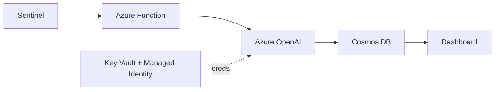

## Setup

**Prerequisites:** Azure subscription with Owner access, Python 3.11+, Azure Functions Core Tools, Azure CLI.

1. **Sentinel workspace** — create a Log Analytics workspace, enable Microsoft Sentinel on it.
2. **Azure OpenAI** — deploy a `gpt-5-mini` model (or current-generation small model — check the Azure AI Foundry model catalog for what's current, as model availability changes over time).
3. **Key Vault** — create a vault with RBAC access mode enabled. Store two secrets: `openai-api-key`, `openai-endpoint`.
4. **Cosmos DB** — create a Serverless NoSQL account, database `TriageDB`, container `Incidents`, partition key `/incident_id`.
5. **Function App** — Python runtime, Linux, Consumption/Flex plan. Enable System-Assigned Managed Identity.
6. **Grant access:**
   - Key Vault → Access control (IAM) → assign `Key Vault Secrets User` to the Function's Managed Identity
   - Cosmos DB → assign `Cosmos DB Built-in Data Contributor` to the Function's Managed Identity via CLI:
```bash
     az cosmosdb sql role assignment create \
       --account-name <your-cosmos-account> \
       --resource-group <your-rg> \
       --scope "/" \
       --principal-id <function-managed-identity-principal-id> \
       --role-definition-id 00000000-0000-0000-0000-000000000002
```
7. **Deploy the Function:**
```bash
   cd function
   pip install -r requirements.txt
   func azure functionapp publish <your-function-app-name>
```
   Update the hardcoded config values at the top of `function_app.py` (Key Vault URL, workspace ID, Cosmos endpoint, deployment name) to match your own resource names before deploying.
8. **Run the dashboard locally:**
```bash
   cd dashboard
   pip install -r requirements.txt
   python -m streamlit run dashboard.py
```
   Update `COSMOS_ENDPOINT` at the top of `dashboard.py` to match the Cosmos account

Both the Function and dashboard authenticate via `DefaultAzureCredential`. Locally, this falls back to the `az login` session; deployed, it uses the Function's Managed Identity.

## Sentinel & Sample Data

Microsoft Sentinel was enabled in a Log Analytics workspace and populated with realistic sample security incidents spanning multiple attack categories, including phishing, malware, password spray, Kerberos Golden Ticket attempts, and anonymous IP sign-ins.

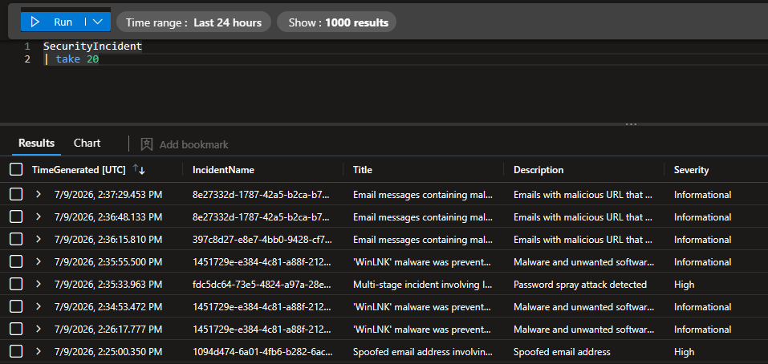

## Azure OpenAI Integration

A `gpt-5-mini` deployment was tested manually in Azure AI Foundry's Playground against 5+ varied incident types before any automation was built, confirming reliability and schema-consistent JSON output.

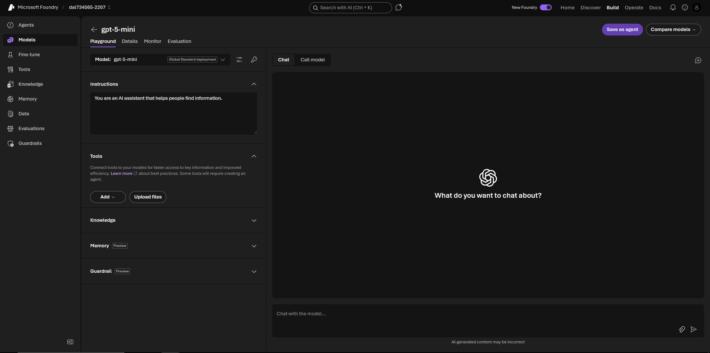

**Golden Ticket attack** - input severity "High," correctly escalated to "critical":

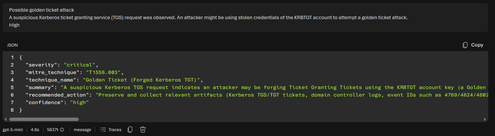

**Anonymous IP sign-in:**

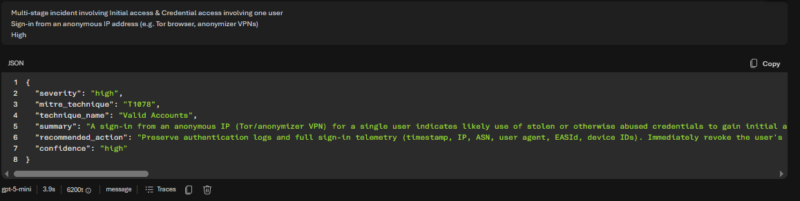

## Identity & Secrets Management

OpenAI credentials are stored in Key Vault; the Function authenticates via a System-Assigned Managed Identity, scoped to the minimum required roles (`Key Vault Secrets User`, `Cosmos DB Built-in Data Contributor`).

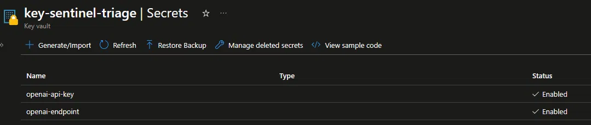

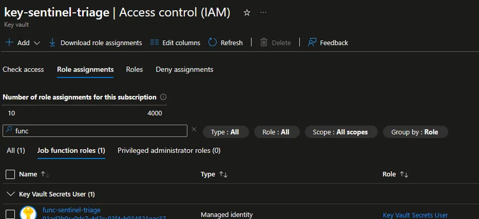

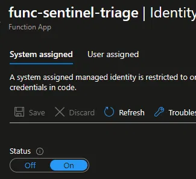

## Azure Function — Orchestration

A Python timer-triggered function runs every 15 minutes which does the following: queries Sentinel for incidents, checks Cosmos DB for already-processed IDs, calls Azure OpenAI for new incidents, parses the structured response, and writes the combined record. Failures are caught and logged as `enrichment_failed` rather than dropped.

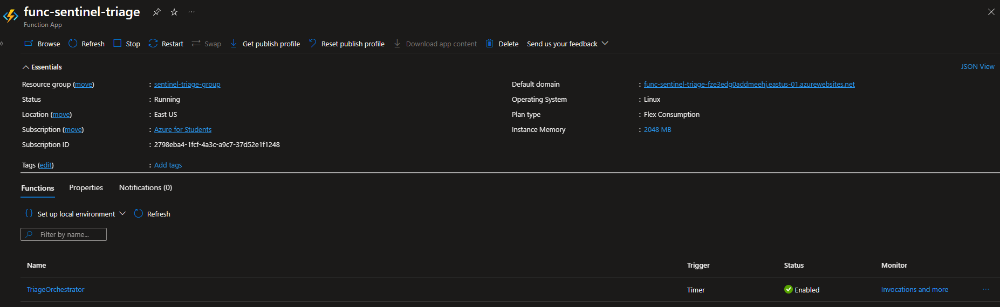

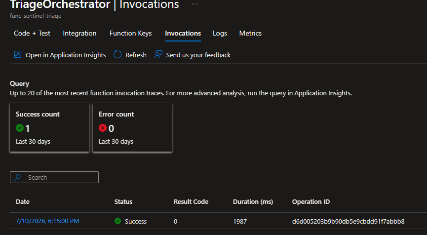

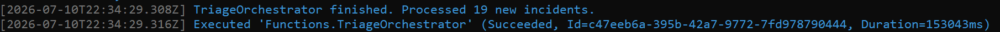

## Cosmos DB - Storage

Each record pairs the raw Sentinel alert, the AI enrichment, a full decision log (model, timestamp, raw output, etc.), and a human review block, all in one document, queryable by severity or parse status.

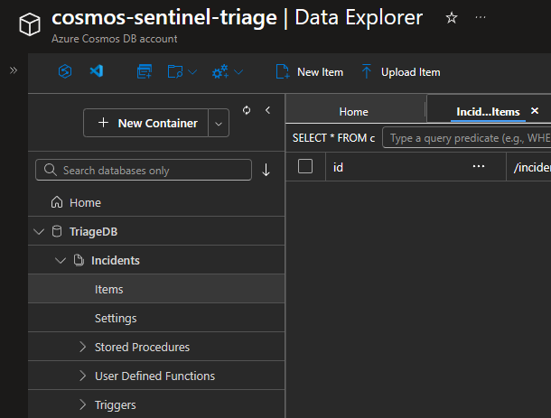

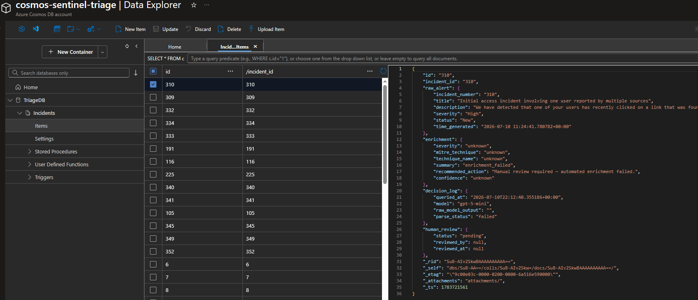

## Dashboard — Human Review

A Streamlit dashboard reads directly from Cosmos DB, presenting an organized, filterable incident log with detailed views. Every incident requires an explicit Approve, Reject, or Needs Review decision.

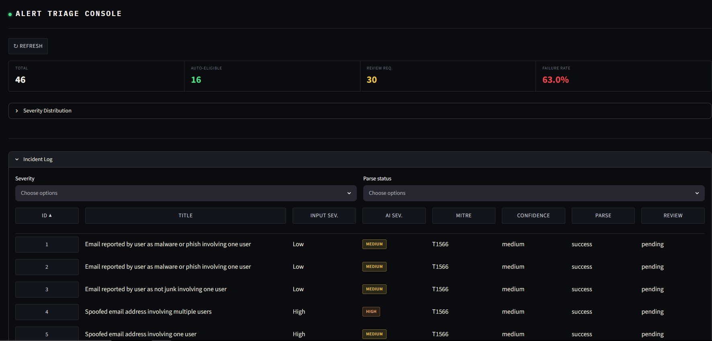

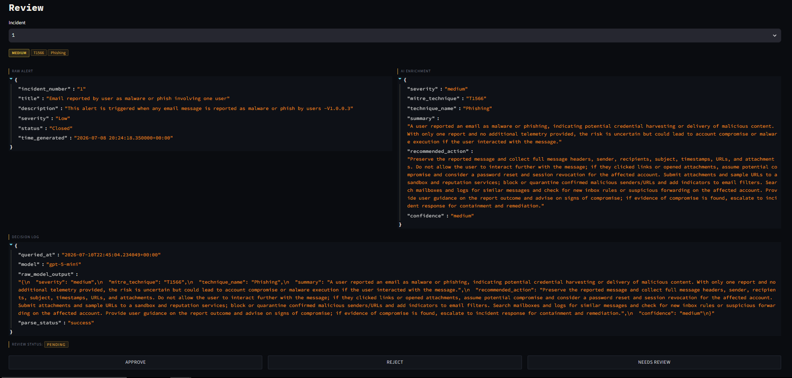

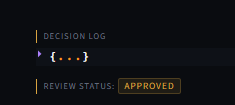

## Output Analysis

- The model does not simply mirror Sentinel's input severity field, it reassesses risk based on incident content. Observed cases included both upgrades (an "Informational" phishing-URL incident reassessed as "medium") and downgrades (a "High" spoofed-email incident reassessed as "medium"), alongside a correct escalation on a genuine Golden Ticket attack (input "High" output "critical").
- JSON schema adherence was 100% across all manually tested incidents in Playground testing.
- End-to-end pipeline reliability: 100% successful scheduled executions over a multi-hour observation window post-deployment, with zero unhandled errors.

A follow-up iteration with hand-labeled ground truth and formal precision/recall metrics per incident type is a natural next step.

## Conclusion

This project was an enjoyable deep dive into operating real cloud infrastructure. I have a much stronger practical understanding of Managed Identity, RBAC, and least-privilege access chains. The end result is a working, unattended AI triage pipeline with independent LLM risk assessment, zero hardcoded credentials, and a functional human-in-the-loop review layer.
